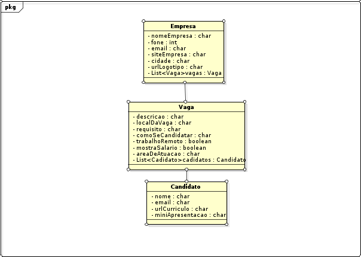

# Jobs-App

Atividade realizada em grupo no dia 07/06/2017 na disciplina de Programação Corporativa.

Analisar a modelagem  do site https://hipsters.jobs/

## Parte Descritiva
 
Foram encontradas 4 classes principais:
> Empresa

> Vaga

> Cargo

> Candidato

## Diagrama de Classes

Obtemos o seguinte diagrama:

